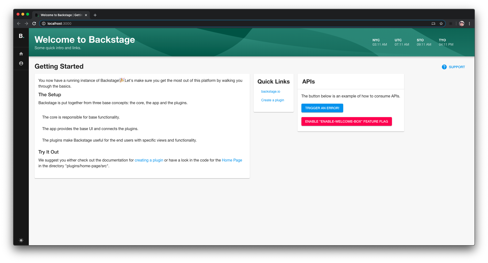
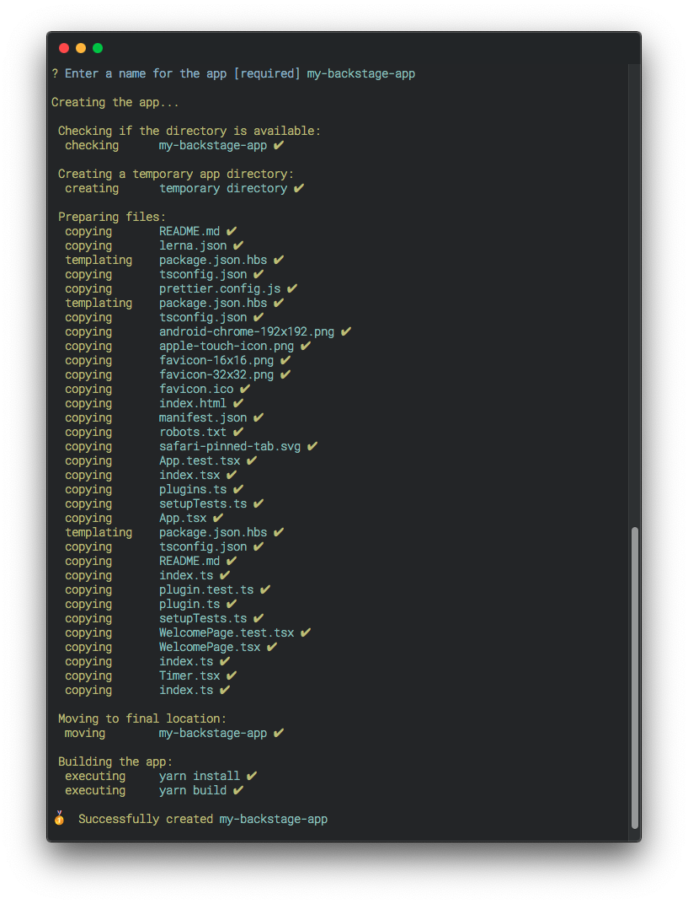

Getting started with Backstage should be as easy as possible. Even though Backstage is still in an early phase of its development, we believe it is important for our users to get a feel of what Backstage really is.

We want to allow users to be able to create their own Backstage - so that they can take advantage of all the infrastructure that we've built into it, and start exploring - in a quick and easy way.

With this blog post we are looking at what a Backstage App is and how easy it is to create one using our [`CLI`](https://www.npmjs.com/package/@backstage/cli).

<!--truncate-->

## What is a Backstage App?



A Backstage App is a modern monorepo web-project that is built using Backstage packages. It includes all the configuration and architecture needed to run Backstage so that you don't need to worry about setting everything up by yourself.

More specifically, a Backstage App is using Backstage's core packages and APIs that provides base functionality to the app. The actual UX is provided by different plugins. As an example, when you first load the `/` page of the App, the content is provided by the `welcome`-plugin.

Plugins are the essential building blocks of Backstage and extend the platform by providing additional features and functionality. _Read more about [plugins](https://github.com/spotify/backstage/tree/master/docs/getting-started)._

## How do I create an app?

Just run the `backstage-cli`:

```bash
npx @backstage/cli create-app
```

We will just ask for a name of the app, and then create everything you need:



The only thing you need to do is to start the app:

```bash
cd my-backstage-app
yarn start
```

And you are good to go! 👍

_Read the full [docs](https://github.com/spotify/backstage/blob/master/docs/create-an-app.md)._

## What do I get? (Let's get technical...)

We have spent a lot of effort to include everything needed and tweaking all the infrastructure so that it fits our needs. And we think it will fit yours too!

### 1. Lerna setup to manage multi-packages

The monorepo and its packages are managed by [`lerna`](https://lerna.js.org/). It lets you work with individual packages in a controlled way.

### 2. Fast builds

Behind the scenes we use [`rollup`](https://rollupjs.org/) to build the modules.

Each package is being individually built. With the `--watch` flag you will be able to detect changes per package and therefore speed up the local development process.

We have also included our own caching system to not rebuild unchanged packages to further speed things up.

Our hope is that there will be thousands of Backstage Plugins in the future, so we need a fast and stable build process.

### 3. Full Typescript support

Most of the codebase is written in [Typescript](https://www.typescriptlang.org/) and we aim for all of the core packages to be in Typescript in the future.

All the knobs and handles needed for a stable and functioning Typescript project is included.

Take a look at `@backstage/cli/config/tsconfig.json` for more details.

### 4. Tests and coverage out of the box

We include testing, linting and end-to-end tests for your convenience.

```bash
yarn lint:all
yarn test:all
yarn test:e2e
```

## Extend the App with Plugins

At Spotify, the main success factor behind Backstage has been the large collection of plugins that has been contributed by various teams. Internally we have more than a hundred different plugins.

Once set up with your Backstage App, you can start creating your own plugins by simply running:

```bash
npx @backstage/cli create-plugin
```

in the root of your Backstage App directory.

## Future

<!-- Something might go here? -->
